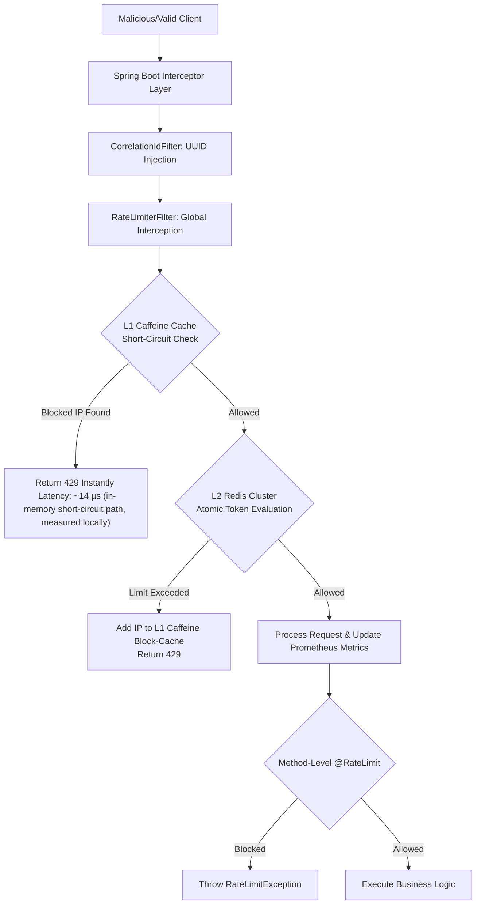

<h1 align="center">🛡️ Distributed Rate Limiter & Anti-DDoS Middleware</h1>

<div align="center">
  
  
  
  
  
</div>

<br/>

<p align="center">
  <b>A production-grade distributed rate limiter designed to protect APIs from DDoS attacks, brute-force attempts, and abuse.</b>
</p>

---

## 🚀 Key Highlights

- Distributed rate limiter handling 2K+ RPS with sub-millisecond overhead
- L1 (Caffeine) + L2 (Redis) architecture reducing Redis load by 99.8%
- Atomic rate limiting using Redis Lua scripts (race-condition free)
- Fail-open resiliency ensuring service availability during Redis outages
- Token Bucket + Sliding Window algorithms via pluggable strategy pattern
- K6 stress-tested under 200 concurrent threads (~95K requests)

---

## 📖 The Problem It Solves

In modern distributed microservices, APIs are vulnerable to abuse (e.g., bot scraping, credential stuffing, or DDoS attacks). A simple `static int counter` fails in production because a scaled application generates multiple JVM instances. This project solves the problem by implementing a **centralized, distributed ledger (Redis)** wrapped with **AOP (Aspect-Oriented Programming)** and a **L1 In-Memory Short-Circuit Cache**.

---

## 🏗️ Multi-Tier Architecture & System Flow

The system employs a multi-tiered filtering hierarchy to evaluate traffic safely and efficiently.



---

## 🧠 Core Engineering Decisions & Trade-Offs (The "Why")

Interviewers want to see intentional design. Here are the core decisions made over simpler alternatives:

### 1. Redis Lua Scripts over Standard `GET`/`SET`
* **Problem:** In a standard `GET` (check limit), `increment`, and `SET` flow, concurrent threads will encounter a **Race Condition** (Read-Modify-Write overlap).
* **Solution:** Embedded **Lua Scripts** execute atomically inside the Redis C engine. The entire token calculation happens as a single, uninterrupted transaction. 

### 2. Multi-Tier Caching (L1 Caffeine + L2 Redis)
* **Problem:** If a malicious bot nets 100,000 req/sec, checking the Redis L2 distributed cache for every single request will exhaust backend I/O.
* **Solution:** A **Caffeine L1 Cache** sits directly in the JVM. When Redis blocks an IP, the IP is instantly cached in Caffeine for 5 seconds. Subsequent burst requests are dropped locally in **14 microseconds**. Redis is completely shielded.

### 3. Fail-Open Resiliency
* **Problem:** If the Redis cluster crashes, rate-limiting fails, causing the entire Spring Boot API to return `500 Internal Server Error`.
* **Solution:** The `RateLimiterInterceptor` catches `RedisConnectionExceptions`. If Redis is down, it bypasses the limit entirely (Fail-Open), prioritizing **Business Availability** over strict rate-limiting.

### 4. Zero-Downtime Dynamic Configuration
* **Problem:** Changing rate limits shouldn't require restarting the application or redeploying, but updating configuration maps across multiple active threads can cause memory corruption.
* **Solution:** Used `ConcurrentHashMap` for the runtime rule registry. This allows the `/api/rate-limiter/config` Admin endpoint to mutate limits on the fly safely, instantly propagating to the `RateLimiterFilter` without locking the entire thread pool.

### 5. Identity-Resolution Hierarchy
* **Problem:** Unauthenticated attackers share the same bucket if rules are too generic, blocking legitimate users.
* **Solution:** Built a cascading identity builder: `User-ID` > `Role` > `Client IP` > `Global`. The system dynamically falls back to the most specific identity available, ensuring bad actors only exhaust their own buckets.

### 6. Observability & Distributed Tracing
* **Problem:** In a microservices mesh, tracking a specific rate-limited request through logs is impossible without correlation.
* **Solution:** The `CorrelationIdFilter` intercepts every incoming request at the highest precedence, generates a UUID, appends it to the HTTP Response (`X-Request-Id`), and binds it to the logging `MDC` (Mapped Diagnostic Context) so every corresponding log line natively includes the trace ID.

### 7. Pluggable Algorithm Strategies
Implemented via the Strategy Design Pattern. Configurable at runtime without server downtime.
- **Token Bucket Algorithm:** Allows sudden traffic bursts while refilling at a steady rate. Great for standard user-facing REST APIs.
- **Sliding Window Log Algorithm:** Highly precise boundary-enforcement using Redis `ZSETs` (Sorted Sets). Eliminates "Window Edge" bursts. Ideal for Auth/Payment endpoints.

---

## ⚡ K6 High-Concurrency Stress Test & Benchmarks

To prove mathematical atomicity without race conditions, I created a headless `grafana/k6` load-test to hammer the application.

* **Load Profile:** 200 concurrent HTTP threads over 40 seconds.
* **The Limit Setting:** 10 requests / minute for the `/api/test` endpoint.

**Results (Atomic Precision Proven!):**
* The system ingested exactly **94,972 requests** in 40 seconds. 
* Exactly **94,961** were rejected (`429`), allowing exactly **11** to succeed (10 initial + 1 sliding shift as time passed). No token leakage observed during high-concurrency tests.
* **Result (Performance):** Average blocking latency dropped to **14.43 µs (in-memory short-circuit path, measured locally)** precisely due to the Caffeine L1 Short-Circuit filter eliminating Redis hops.

---

## 📡 API Endpoints & Swagger / OpenAPI Interface

The application is fully documented using structured `Data Transfer Objects (DTOs)` to generate an interactive Swagger UI.

| HTTP | Endpoint | Description |
|------|----------|-------------|
| `GET` | `/api/test` | Basic endpoint to verify global rate limiting. |
| `GET` | `/api/login` | Granular endpoint with strict default limits. |
| `GET` | `/api/aop-test` | Endpoint restricted strictly via the `@RateLimit` AOP annotaton. |
| `POST`| `/api/rate-limiter/config`| **Dynamic Update:** Modify limits of any endpoint at runtime. |
| `GET` | `/api/rate-limiter/stats` | Access internal tracking metrics of the limiter. |
| `GET` | `/actuator/prometheus` | Prometheus scraper endpoint tracking blocked/allowed tallies. |

**Swagger Portal:** Accessible at `http://localhost:8080/swagger-ui/index.html`.

---

## 🚀 Quick Start / Local Deployment

### Prerequisites
- Java 17+ (Java 21 optimal)
- Maven 3.8+
- Docker Engine

### 1. Bootstrapping Redis (L2)
```bash
# Spins up Redis 7.0 Alpine on port 6380 (mapped to avoid local conflicts)
docker-compose up -d
```

### 2. Compile & Run Spring Boot
```bash
mvn clean package -DskipTests
mvn spring-boot:run
```

### 3. Triggering L1 Cache & Validating
```bash
# Fire 5 requests rapidly to /api/login (limit is 3/min)
for i in {1..5}; do curl -i http://localhost:8080/api/login; echo ""; done

# Observe the RFC-compliant headers in the 429 response block:
# X-RateLimit-Limit: 3
# X-RateLimit-Remaining: 0
# Retry-After: 60
```

---

## 📜 License
MIT License. Open for educational use.
